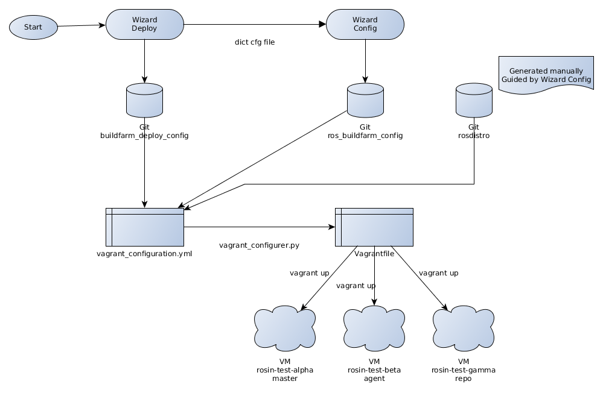

# Vagrant images for the buildfarm

## Motivation

By no means using this tool will produce a Buildfarm that can be used in production. The objective of this tool was to facilitate testing different Buildfarm configurations, and learning the use of the Buildfarm. It also lets test updates and changes in a _safe_ environment.

Incidentally currently it is required to have three different machines to run the Buildfarm; this tool lets you configure and try the Buildfarm in a single machine, supposing that you have enough resources to spin up three virtual machines.

## What it does

Basically the idea is that you configure a single yaml file, pointing to the repositories where you have stored your Buildfarm configuration, and the tool generates a Buildfarm instance using that configuration. This is divided into three phases:

1) Provision the three virtual machines
1) Install the Buildfarm requirements and run the deploy scripts
1) Prepare the infrastructure and launch the Jenkins job configuration

The user can choose to run the three phases at once, or skip some of them.

To simplify things, some tricks are being used:

- The IP addresses of the _master_ and _repo_ machines are fixed, in order to make it easier to connect from one to the other. A script opens the yaml files in the Buildfarm configuration containing the IP addresses, and hardcodes them.
- To facilitate the use of _private_ rosdistros, the rosdistro repository configured is cloned and served using a simple server. This means that it does not need to be public, but the user should manually synchronize the data in case changes happen.

## Prerequisites

Make sure you have a recent version of VirtualBox and Vagrant.
Also, make sure that VirtualBox is running properly.

```bash
vagrant --version
vboxmanage --version
```

This has been tested with [Vagrant version 2.2.4](https://releases.hashicorp.com/vagrant/2.2.4/) and [VirtualBox version 5.2.18](https://download.virtualbox.org/virtualbox/5.2.18/).

If you are running in Ubuntu 16.04 distribution, download Vagrant version described above, don't install the package that comes with your distribution.

Once installed, install the following Vagrant plugin:

```bash
vagrant plugin install vagrant-disksize
```

## Steps to use

Once prerequisites have been fulfilled, the steps to use Vagrant to have a ROS Buildfarm instance up and running are:

1. Edit the `vagrant_configuration.yml` file and set the appropriate configuration for your setup
1. Run through `python3` the `vagrant_configurer.py` script to load the yaml configuration file and generate the `Vagrantfile`
1. Run `vagrant up` to load the `Vagrantfile` and generate the virtual machines

Flow in connection to Wizard:



## Configuration

The Vagrant ROS Buildfarm deploy requires access to 4 different git repositories.
Those are configured in the `vagrant_configuration.yml` file.

You should not change the repository `ros_buildfarm` unless you know what you are doing and you are testing some custom changes.

For the other required 3 repositories take into account that if the repositories need authentication, the credentials need to be specified in the URL in the following form: `http://<USER>:<PASSWORD>@server.address/path/repo.git`.
Instead of using user/password we recommend to use deploy tokens.

After every change in the `vagrant_configuration.yml` file remember to rerun the `vagrant_configurer.py` script to apply the changes.

## Build

Build the virtual machine by entering the folder where the Vagrantfile is located, and running:

```bash
vagrant up
```

This will create the virtual machine and spin it.

You can interact with the virtual machine by running:

```bash
cd to_Vagrantfile_folder
vagrant ssh machine_hostname
```

## Running

Once the system is up and running, you can enter the Jenkins UI in:

<http://192.168.50.10/>

It is quite possible that after the initial setup, there is no connection between the master and the agents. Usually restarting the agents fixes the problem:

```bash
bash utils/restart.agents.sh
```

## Managing machines created

The [official documentation][vagrant_cli] provides the list of command that can be used to manage the created machines.

[vagrant_cli]: https://www.vagrantup.com/docs/cli/

The `utils` folder contains a set of simple bash scripts to facilitate operations.

Some useful aliases:

```bash
alias vagrant_resume_all='vagrant global-status | awk "/saved/{print \$1}" | xargs -r -d "\n" -n 1 -- vagrant resume'
```

```bash
alias vagrant_suspend_all='vagrant global-status | awk "/running/{print \$1}" | xargs -r -d "\n" -n 1 -- vagrant suspend'
```
